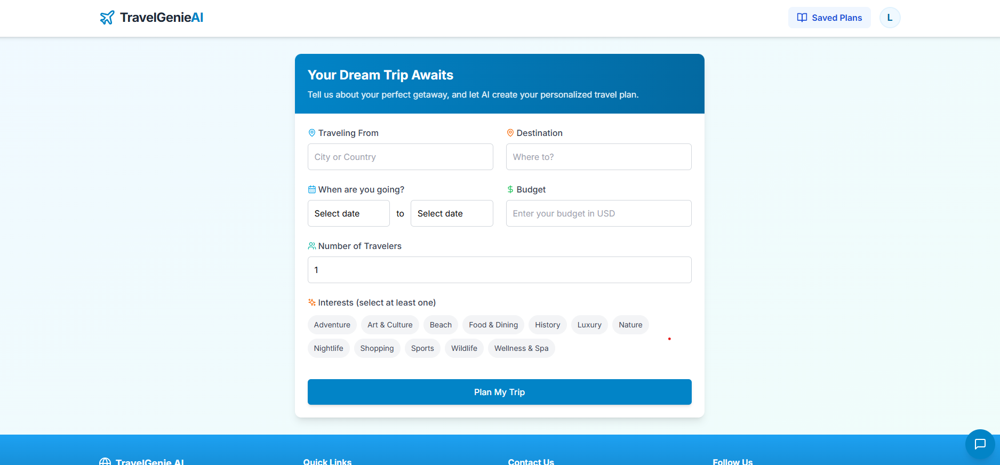
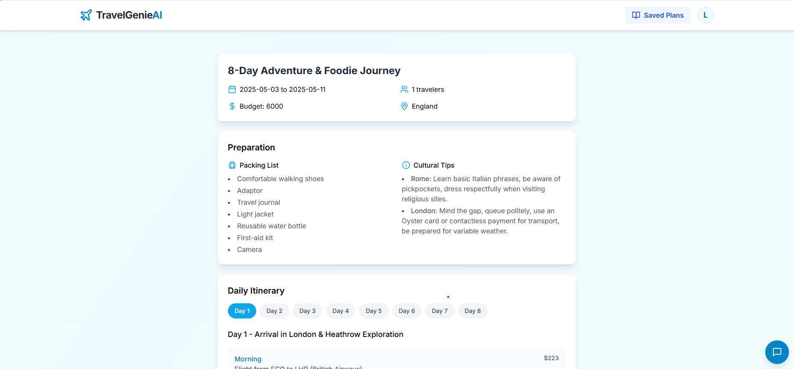
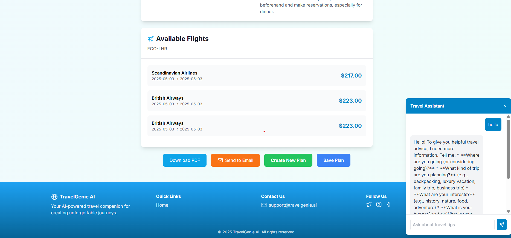

# 🌍 Travel Planning AI Agent 🧳

A full-stack AI-powered travel planning application that helps users create personalized travel itineraries, find flight and hotel options, and manage their travel plans - all with the help of artificial intelligence.


## ✨ Features

- 🤖 AI-driven travel itinerary generation
- ✈️ Real-time flight search and recommendations
- 🏨 Hotel search and booking suggestions
- 📅 Day-by-day activity planning
- 💰 Budget management and breakdown
- 📧 Email itinerary sharing functionality
- 📱 Responsive design for all devices

## 🏗️ Tech Stack

### Backend

- 🐍 Python with FastAPI
- 🧠 Google Generative AI (Gemini) for itinerary generation
- 🔍 SerpAPI for flight and hotel data
- 📨 Email service integration

### Frontend

- ⚛️ React.js
- 🎨 Tailwind CSS for styling
- 🚀 Vite as build tool
- 📝 JSPdf for PDF generation
- 🔄 Framer Motion for animations
- 📅 Supabase

## 🚀 Getting Started

### Prerequisites

- Node.js (v16 or higher)
- Python (v3.8 or higher)
- npm or yarn
- Git

### Environment Variables

Create a `.env` file in the project root with the following variables:

```
GEMINI_API_KEY=your_gemini_api_key
SERPAPI_API_KEY=your_serpapi_api_key
EMAIL_SERVICE_API_KEY=your_email_service_api_key (optional)

note: for our mentors you will find it in extra links(text file in drive)
```

### Installation

#### Backend Setup

1. Clone the repository:

   ```bash
   git clone https://github.com/Lak-MedRida027/TravelGenieAl.git
   cd TravelGenieAl
   ```

2. Create and activate a virtual environment:

   ```bash
   cd server
   
   python -m venv .venv
   
   # On Windows
   .\.venv\Scripts\activate
   
   # On macOS/Linux
   source venv/bin/activate
   ```

3. Install backend dependencies:

   ```bash
   pip install fastapi uvicorn python-dotenv requests google-generativeai
   ```

4. Run the backend server:

   ```bash
   uvicorn agent:app --reload --port 8001

   or

   python agent.py
   ```

#### Frontend Setup

1. Navigate to the frontend directory:

   ```bash
   cd frontend
   ```

2. Install frontend dependencies:

   ```bash
   npm install
   # or
   yarn install
   ```

3. Start the development server:

   ```bash
   npm run dev
   # or
   yarn dev
   ```

4. Open your browser and visit:

   ```
   http://localhost:5173
   ```

## 📋 API Endpoints

- `POST /generate-travel-plan` - Generate a complete travel plan
- `GET /health` - Health check endpoint
- `POST /send_mail` - Send travel plan via email

## 🔧 Development

### Running Tests

```bash
# Backend tests
pytest

# Frontend tests
npm test
```

### Building for Production

```bash
# Build frontend
npm run build

# Run production server
uvicorn agent:app --host 0.0.0.0 --port 8001
```

## 📱 Screenshots






## 🤝 Contributing

Contributions are welcome! Please feel free to submit a Pull Request.

1. Fork the repository
2. Create your feature branch (`git checkout -b feature/amazing-feature`)
3. Commit your changes (`git commit -m 'Add some amazing feature'`)
4. Push to the branch (`git push origin feature/amazing-feature`)
5. Open a Pull Request

## 📄 License

This project is licensed under the MIT License - see the LICENSE file for details.

## 🙏 Acknowledgements

- [Google Generative AI](https://ai.google/discover/generativeai/) for powering our AI features
- [SerpAPI](https://serpapi.com/) for travel data
- [FastAPI](https://fastapi.tiangolo.com/) for the backend framework
- [React](https://reactjs.org/) for the frontend library
- [Tailwind CSS](https://tailwindcss.com/) for styling
